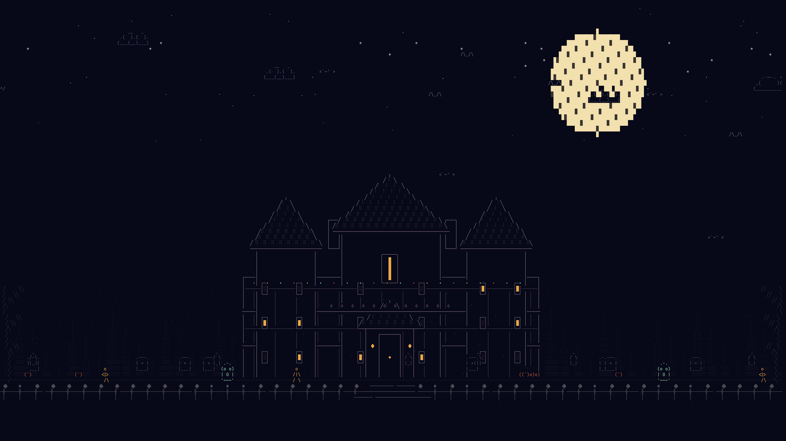

# Omarchtober

[](https://github.com/DailenG/omarchtober/actions/workflows/ci.yml)
[](LICENSE)
[](https://omarchy.org/)

An original, terminal-native Halloween nightscape for Omarchy. Omarchtober turns every monitor into a moonlit Victorian estate with configurable clouds, stars, bats, graves, pumpkins, emerging figures, and wandering visitors.

**[Website](https://daileng.github.io/omarchtober/)** · **[Scene authoring](docs/SCENE_AUTHORING.md)** · **[Roadmap](ROADMAP.md)** · **[Configuration](docs/CONFIGURATION.md)**

<p align="center">
  
</p>

## Why Omarchtober

- **One safe mode switch** — Fun mode replaces undead figures and blood accents with friendly ghosts, costumed walkers, colored lights, gentler thunder, and owl-like calls.
- **An ANSI diorama flagship** — connected Unicode architecture, Braille-textured roofs and forest, layered fog, a full moon, animated windows, bats, gravestones, pumpkins, and wandering visitors.
- **Adaptive composition** — Compact and Standard stay deliberately simple; Cinematic and Panoramic introduce the detailed manor, atmospheric depth, framing branches, and foreground architecture.
- **Exact population controls** — user-configured counts remain authoritative at every detail tier.
- **Four palettes** — Moonlit, Harvest, Spectral, and Monochrome.
- **Optional audio** — locally synthesized wind, thunder, and nocturnal calls, or a user-selected MP3/MP4/audio file through `mpv`.
- **Omarchy-native lifecycle** — tray control, fullscreen terminals on every monitor, inhibitor-aware idle timing, and unchanged lock behavior.
- **Scene platform** — a documented registry and AI-agent prompt for adding original scenes without changing shell integration.

No Python packages, remote runtime assets, privileged writes, or copied movie characters.

## Install

```bash
omarchy plugin add https://github.com/DailenG/omarchtober --enable
```

The pumpkin icon appears in the system tray. Click it for Nightscape Control, middle-click to begin immediately, or right-click for the action menu.

## Use

| Action | Result |
|---|---|
| Click tray icon | Open Nightscape Control |
| Middle-click tray icon | Begin the configured nightscape |
| **FUN** | Enforce the family-friendly visual and audio treatment |
| **SCARY** | Enable undead figures, darker audio, and blood accents |
| **Begin Night** | Save settings and open one scene on every monitor |
| Any key or click | Return to the desktop |
| Pointer movement | Return when the setting is enabled |

Shell IPC:

```bash
omarchy-shell omarchtober configure
omarchy-shell omarchtober start
omarchy-shell omarchtober stop
```

## Configuration

Settings are written atomically to:

```text
~/.config/omarchtober/config.json
```

The control room exposes mode, scene, exact element populations, lightning, animation speed, palette, audio source, audio layers, idle integration, and pointer dismissal. See [Configuration](docs/CONFIGURATION.md) for limits and semantics.

### Deterministic preview

No fullscreen window is needed:

```bash
python3 scripts/omarchtober.py --snapshot --width 120 --height 36 --seed 7
python3 scripts/omarchtober.py --snapshot --width 200 --height 52 --seed 7
python3 scripts/omarchtober.py --check-config
python3 scripts/omarchtober.py --list-scenes
```

## Audio

Audio is disabled by default. Procedural mode generates wind, sparse thunder, and nocturnal calls locally and streams raw stereo PCM to PipeWire. Fun mode softens thunder and raises creature-call pitch. Custom Media mode loops a local allowlisted audio or video file through `mpv`; video is never displayed.

One process acquires a private no-follow lock, so multi-monitor sessions produce one audio stream. Test the selected source with:

```bash
python3 scripts/omarchtober.py --audio-test 8
```

No audio download or license decision is required. Users who want a recording select their own local MP3, MP4, M4A, OGG, OPUS, FLAC, WAV, or WEBM file.

## Adaptive detail

The renderer derives detail from terminal cell dimensions:

| Tier | Minimum | Added composition |
|---|---:|---|
| Compact | below 75×25 | Essential silhouette and animation |
| Standard | 75×25 | Full estate and graveyard |
| Cinematic | 135×38 | Procedural ANSI manor, Braille texture, animated windows, iron fencing |
| Panoramic | 190×48 | Layered forest and fog, framing branches, foreground steps, wide staging |

Configured stars, bats, graves, figures, walkers, clouds, and pumpkins never increase automatically.

## Create a scene

Read [Scene Authoring](docs/SCENE_AUTHORING.md). It defines the scene interface, fun/scary safety contract, deterministic checks, resource ceilings, registry steps, and a copy-ready prompt for an Omarchy AI agent. `AGENTS.md` repeats the repository invariants for agents operating inside the checkout.

Scenes must use original archetypes rather than copyrighted movie characters, names, masks, houses, or music.

## Development

```bash
git clone https://github.com/DailenG/omarchtober
cd omarchtober
python3 -m unittest discover -s tests -v
python3 -m py_compile omarchtober/*.py omarchtober/scenes/*.py scripts/omarchtober.py
bash -n scripts/launch-omarchtober scripts/idle-integration scripts/select-media
omarchy plugin validate .
/usr/lib/qt6/bin/qmllint -I "$OMARCHY_PATH/shell" Service.qml Config.qml
```

Live setup and pull-request expectations are in [CONTRIBUTING.md](CONTRIBUTING.md). Architecture and trust boundaries are in [Architecture](docs/ARCHITECTURE.md) and [Security](SECURITY.md).

## License

MIT © 2026 Dailen Gunter.
