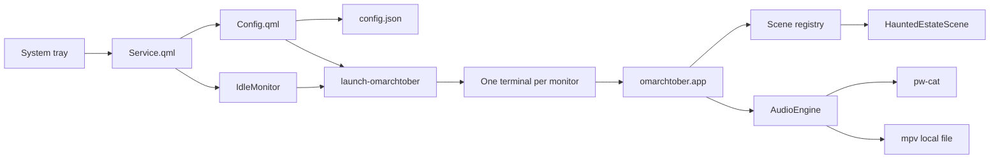

# Architecture

Omarchtober separates long-lived Omarchy integration from rendering and audio. The shared Quickshell process owns only the tray, overlay, idle monitor, and process launch. Animation work exists only while the screensaver is visible.

## Plugin lifecycle

`manifest.json` declares a namespaced service and overlay under `dailen.omarchtober`. `Service.qml` keeps the tray and idle monitor loaded. `Config.qml` is created when summoned and writes normalized configuration atomically.

The renderer independently normalizes the same public contract. A missing, malformed, partial, oversized, or out-of-range user file therefore cannot prevent startup.

## Scene contract

`omarchtober.scenes.base.Scene` requires:

- immutable metadata in `Scene.info`;
- deterministic construction from width, height, normalized config, and seed;
- a terminal background color;
- resize, update, and render operations;
- a bounded `FrameBuffer` result.

`omarchtober.scenes.create_scene` is the only runtime registry boundary. Scene modules never import QML, launch processes, read user configuration, or own audio.

## Adaptive composition

A scene may derive layout from dimensions, but configured populations are exact. Haunted Estate uses four tiers: Compact, Standard, Cinematic, and Panoramic. Compact and Standard use the essential sprite composition. Cinematic and Panoramic build a proportional ANSI diorama from bounded box-drawing primitives, Braille texture, layered forest and fog, framing branches, and foreground architecture. None silently add configured entities.

This distinction keeps settings predictable across monitors while using available terminal cells effectively.

## Fun-mode safety

`experience.mode` is a global content override, not a color preset. Every scene must supply explicit Fun and Scary treatments. For Haunted Estate:

- friendly ghosts replace skeleton risers;
- costumed visitors replace undead walkers;
- colored lights replace blood drips;
- thunder amplitude is reduced;
- creature calls use a softer, higher register.

A contributed scene may omit Scary content. It may not mark unsafe content as Fun.

## Renderer loop

The terminal enters the alternate screen, hides the cursor, and enables SGR any-motion reporting. The loop runs at 24 FPS, uses monotonic time, clamps resize allocations to 500×200 cells, and distinguishes pointer movement from clicks and keyboard bytes. Cleanup restores terminal modes after normal exit or signals.

## Multi-monitor and idle behavior

`scripts/launch-omarchtober` follows Omarchy's screensaver window contract. It launches one supported terminal per monitor with the `org.omarchy.screensaver` identity and restores monitor focus. Omarchy continues to own lock timing.

`scripts/idle-integration` suppresses only the stock visualizer while enabled. It records a matching private ownership marker and never removes a user-owned, replaced, mismatched, or symlinked toggle.

## Audio

Every renderer may request audio, but `AudioEngine` takes a non-blocking no-follow lock in a private runtime directory. One monitor becomes the audio leader.

- **Procedural:** signed 16-bit, 24 kHz stereo PCM generated locally and streamed to `pw-cat`.
- **Custom media:** an absolute, regular, non-symlink local file with an allowlisted extension and 2 GiB ceiling, played audio-only through `mpv`.

Audio is disabled by default. No runtime network request occurs.

## Resource boundaries

| Resource | Boundary |
|---|---|
| Configuration | 256 KiB input cap; atomic writes in mode-0700 directory |
| Frame buffer | 40×16 minimum, 500×200 maximum |
| Entity counts | Per-type maxima enforced during normalization |
| Custom media | Local regular files, allowlisted formats, 2 GiB maximum |
| Audio leadership | One no-follow mode-0600 lock |
| Network | None at runtime |
| Privilege escalation | Never |
| `/usr/share/omarchy` | Read-only terminal defaults only |
