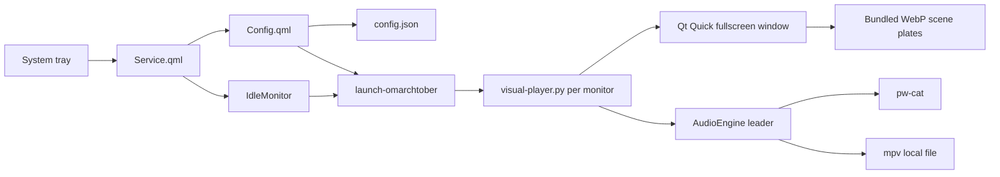

# Architecture

Omarchtober separates the persistent Omarchy integration from the short-lived visual player. The shared shell owns only the tray, control room, idle monitor, and process launch. GPU work and audio exist only while the screensaver is visible.

## Plugin lifecycle

`manifest.json` declares the namespaced `dailen.omarchtober` service and overlay. `Service.qml` keeps the tray and idle monitor loaded. `Config.qml` is created when summoned and writes normalized configuration atomically.

`scripts/launch-omarchtober` reads Hyprland monitor state, launches one fullscreen player for each monitor, waits for the `Omarchtober Visual` window, and restores the original focus. Every process carries the `org.omarchy.screensaver` marker used by Omarchy's start and stop contract.

## Visual player

`scripts/visual-player.py` is the runtime coordinator. It normalizes configuration, resolves approved scene keys to packaged files, starts the single audio leader, then executes `qml6` with explicit arguments.

`visual/Screensaver.qml` owns presentation:

- paired base-plate and transparent parallax-layer stacks alternate and crossfade inside a centered, clipped 16:9 art frame;
- at `art.motion: 0`, `PreserveAspectFit` keeps the complete 16:9 plate visible at every display aspect ratio—no scale or crop;
- at a positive motion pace, one shared bounded camera sweep scales each stack by 4% and travels left-to-right before returning, keeping the art frame covered without user interaction;
- a scene may supply a local `assets/parallax/<scene>/layers.json` manifest with transparent, full-resolution same-canvas layers; Estate's layers shift independently relative to the shared camera sweep.
- each scene loads a bounded `assets/motion/<scene>/lights.json` manifest and renders soft amber radial glows that pulse at per-light periods over the plate's existing lamps;
- a theme overlay shifts the complete collection without recoloring source files;
- a key, click, wheel, or optionally pointer motion closes the window after an arming delay.

## Scene contract

A public scene is one bundled `2560×1440` WebP file in `assets/scenes/`, one stable snake-case key in `omarchtober.config.SCENES`, and one catalog entry in `scenes.json` and `Config.qml`. Parallax-capable scenes additionally package transparent same-canvas WebP layers plus a manifest in `assets/parallax/<scene-file-stem>/`; scenes without layers remain fully supported.

All plates must share the collection's authored language:

- landscape 16:9 composition with a clear focal silhouette;
- midnight navy and near-black ground;
- ivory moonlight, lavender etched contours, and restrained amber lamps;
- dense stippling, hatch marks, and Braille-like texture;
- layered foreground, architecture, horizon, and sky;
- original family-safe Halloween archetypes only.

See [Scene Authoring](SCENE_AUTHORING.md) for production and acceptance requirements.

## Configuration

The QML control room and Python runtime normalize the same schema independently. A missing, malformed, partial, oversized, or out-of-range user file therefore cannot prevent startup. Schema versions one through four migrate safely to version five.

## Multi-monitor and idle behavior

`scripts/launch-omarchtober` follows Omarchy's screensaver identity and focus contract. Exiting one visual player terminates its siblings, so dismissal returns all monitors together. Omarchy continues to own lock timing.

`scripts/idle-integration` suppresses only the stock visualizer while enabled. It records a matching private ownership marker and never removes a user-owned, replaced, mismatched, or symlinked toggle.

## Audio

Every player may request audio, but `AudioEngine` takes a non-blocking no-follow lock in a private runtime directory. One monitor becomes the audio leader.

- **Procedural:** signed 16-bit, 24 kHz stereo PCM generated locally and streamed to `pw-cat`.
- **Custom media:** an absolute, regular, non-symlink local file with an allowlisted extension and 2 GiB ceiling, played audio-only through `mpv`.

Audio is disabled by default. No runtime network request occurs.

## Resource boundaries

| Resource | Boundary |
|---|---|
| Configuration | 256 KiB input cap; atomic writes in mode-0700 directory |
| Scene assets | Four packaged 2560×1440 WebP files; no remote loading |
| Scene rotation | 15–900 seconds |
| Automatic camera pace and Estate parallax depth | 0–2 |
| Scene lights | 24 per scene; bounded position, radius, intensity, and period |
| Custom media | Local regular files, allowlisted formats, 2 GiB maximum |
| Audio leadership | One no-follow mode-0600 lock |
| Network | None at runtime |
| Privilege escalation | Never |
| `/usr/share/omarchy` | Never modified |
